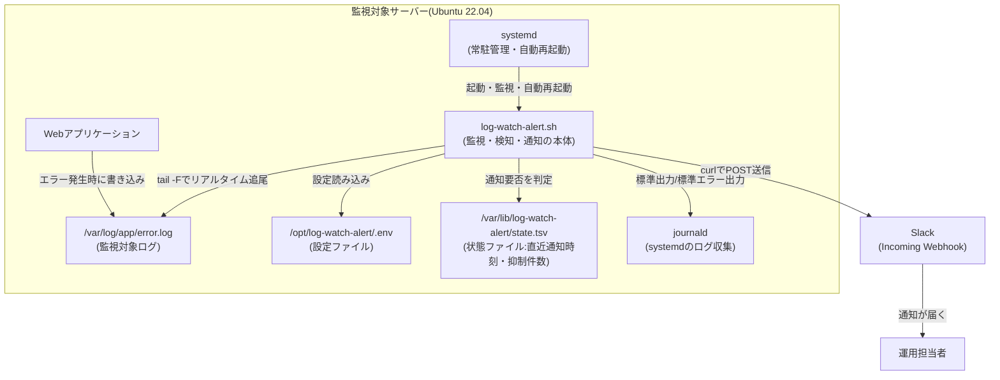
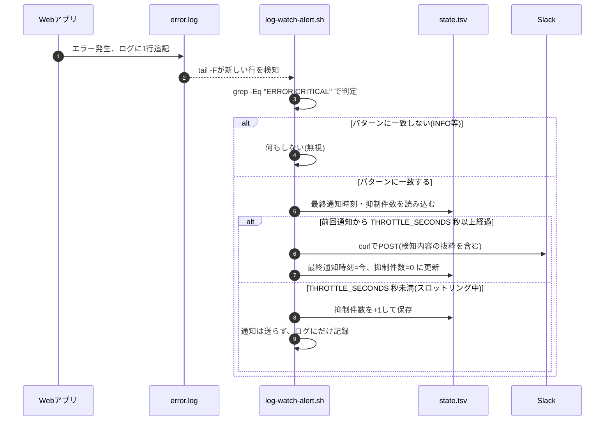

# 02. 設計書

## 1. システム構成

監視・通知処理に関わる要素と、それぞれの役割を図で示す。



**構成要素の役割**

| 要素 | 役割 |
|---|---|
| Webアプリケーション | 障害発生時に`error.log`へ`ERROR`/`CRITICAL`を含む行を書き込む監視対象 |
| systemd | `log-watch-alert.sh`を常駐プロセスとして起動・監視し、落ちたら自動再起動する「番人」 |
| log-watch-alert.sh | ログ追尾・パターン検知・スロットリング判定・Slack通知を行う本体スクリプト |
| .env(設定ファイル) | 監視対象パス・Webhook URL・検知パターン・スロットリング時間などの設定値 |
| state.tsv(状態ファイル) | 「最終通知時刻」「抑制件数」を記録し、スロットリングの判定材料にする |
| journald | systemd配下のプロセスの標準出力を自動的に収集するログ基盤。`journalctl`で参照する |
| Slack Webhook | 検知結果を運用担当者へリアルタイムに届ける通知経路 |

## 2. 処理フロー(シーケンス図)

ログに1行追記されてから、通知される場合・スロットリングで抑制される場合の両方を示す。



**スロットリングの考え方(重要ポイント)**

最初の異常は必ず即座に通知する。その後、同じ設定時間内に再検知しても通知は送らず、代わりに「何件抑制したか」を数え続ける。そして設定時間が過ぎたあとに次の異常を検知したタイミングで、通常の通知に「※このほかN件抑制しました」という一文を添えて送る。これにより、通知の総数は絞りつつも「実は裏で何件起きていたか」という情報を失わずに済む。

## 3. サーバー上のディレクトリ構成

構築先サーバー上の配置は以下の通り(リポジトリ内の`src/`配下のファイルを、この場所へコピーして使う想定)。

```text
/opt/log-watch-alert/
├── log-watch-alert.sh      # 監視本体スクリプト(実行権限 750、所有者 logwatch)
└── .env                     # 設定ファイル(権限 600。Webhook URLを含むため)

/var/log/app/
└── error.log                 # 監視対象ログ(アプリケーション側が出力する想定)

/var/lib/log-watch-alert/
└── state.tsv                 # 状態ファイル(最終通知時刻<TAB>抑制件数)

/etc/systemd/system/
└── log-watch-alert.service   # systemdユニットファイル
```

## 4. 主要な技術要素の解説(初心者向け)

### 4.1 tail -F(ログのリアルタイム追尾)

`tail`はファイルの末尾を表示するコマンド。`-f`(follow)を付けると、追記される新しい行をリアルタイムに表示し続ける「追いかけ表示」モードになる。

```bash
tail -f /var/log/app/error.log
```

ただし、`-f`と`-F`(大文字)には重要な違いがある。

| オプション | 追いかけ方 | ログローテート後の挙動 |
|---|---|---|
| `-f` | 開いた時点の**ファイルディスクリプタ**(=OSがそのファイルの実体を指し示す番号)を追いかける | ファイルが削除・作り直されると、古い実体を見続けてしまい**新しいログを検知できなくなる** |
| `-F`(`--follow=name --retry`と同義) | **ファイル名**を追いかけ、ファイルが無くなっても再接続を試みる | ローテートで新しいファイルが作られても、自動的に追従し直す |

```bash
tail -F -n 0 /var/log/app/error.log
```

```text
tail: /var/log/app/error.log: file truncated
2026-08-31 02:15:03 [ERROR] DB接続に失敗しました
```

> 💡 なぜ`-F`が重要か: 実務のログは`logrotate`(=ログファイルを定期的に切り替えて古いものを圧縮・削除する仕組み)によって、毎日ファイルが入れ替わることが多い。`-f`のまま常駐させると、ローテートされた瞬間から監視が「見えているのに何も検知しない」状態になってしまう。これは気づきにくい障害の典型例なので、常駐監視では必ず`-F`を使う。
>
> なお`-n 0`は「起動時点で既にある行は表示せず、これ以降に追記された行だけを対象にする」という指定。これを付けないと、サービス起動のたびに過去ログを全部読み直して大量の誤通知を送ってしまう。

### 4.2 grep -E(正規表現によるOR条件の判定)

`grep`は指定した文字列(パターン)を含む行を検索するコマンド。`-E`を付けると拡張正規表現(ERE = Extended Regular Expression)というルールでパターンを書けるようになる。

```bash
echo "2026-08-31 02:15:03 [ERROR] DB接続に失敗しました" | grep -E "ERROR|CRITICAL"
```

```text
2026-08-31 02:15:03 [ERROR] DB接続に失敗しました
```

正規表現とは、文字列のパターンを記号で表現する仕組み。今回使う範囲では、まず次の1つを覚えれば十分。

| 記号 | 意味 | 例 |
|---|---|---|
| `\|` | OR条件(どちらかを含めば一致) | `ERROR\|CRITICAL` は「`ERROR`または`CRITICAL`を含む行」に一致する |

```bash
grep -Eq "ERROR|CRITICAL" <<< "$line"
```

`-q`(quiet)を付けると、一致した行を画面に表示せず、「一致した/しなかった」を**終了コード**(`$?`。`0`なら一致、`1`なら不一致)だけで返す。スクリプトの中では行の中身を画面に出す必要はなく、`if`文で判定さえできればよいため、このオプションを使っている。

> 💡 `grep "ERROR"`(`-E`なし)でも単純な文字列検索はできるが、`|`によるOR条件は`-E`(拡張正規表現)を使わないと素直には書けない(`-E`無しだと`\|`のようにエスケープが必要になり読みにくくなる)。複数キーワードを判定したい場合は`-E`を使う、と覚えておくとよい。

### 4.3 Webhookとcurl(Slackへの通知送信)

**Webhookとは**、あるサービス(今回はSlack)が用意した「特定のURLへHTTP POSTでデータを送るだけで、そのサービス内で何かが起きる」という仕組み。Slackの場合は「Incoming Webhook」という機能を有効にすると専用URLが発行され、そのURLへJSON形式のデータをPOSTするだけで、指定したチャンネルにメッセージが投稿される。API認証のための複雑な手続きが不要なので、外部サービスとの連携を素早く実装できる。

`curl`はHTTP通信をコマンドラインから行うツール。

```bash
curl -sS -o /dev/null -w '%{http_code}' \
  -X POST \
  -H 'Content-type: application/json' \
  --data '{"text": "テスト通知です"}' \
  "<YOUR_SLACK_WEBHOOK_URL>"
```

```text
200
```

| オプション | 意味 |
|---|---|
| `-sS` | `-s`(silent。進捗バーを表示しない)+`-S`(silentでもエラーメッセージだけは表示する) |
| `-o /dev/null` | レスポンス本文の表示は不要なので捨てる |
| `-w '%{http_code}'` | 代わりにHTTPステータスコード(`200`なら成功)だけを出力させる |
| `-X POST` | HTTPのPOSTメソッドで送信する |
| `-H 'Content-type: application/json'` | 送信データがJSON形式であることをサーバーに伝えるヘッダー |
| `--data '{...}'` | 送信する本文(JSON)。`text`キーの値がSlackのメッセージ本文になる |

> 💡 なぜHTTPステータスコードを見るのか: `curl`はネットワークの接続自体に成功していれば、Slack側が拒否した場合(URLが無効・削除済みなど)でも終了コードは`0`(成功)を返すことがある。`-w '%{http_code}'`でHTTPステータスコードそのものを確認することで、「送信リクエストは行えたが、Slack側では失敗した」というケースも検知できるようにしている。

### 4.4 jq(JSONを安全に組み立てる)

Slackに送るメッセージ本文には、検知したログ行そのものを含める。しかしログの中身にはダブルクォート`"`や改行が含まれる可能性があり、文字列を手動で連結して`{"text": "..."}`のようなJSONを組み立てると、その文字が原因でJSONの形が壊れてしまうことがある。

`jq`はコマンドラインで使えるJSON処理ツール。`-n`(空の入力から開始)と`--arg`(シェル変数をJSONの文字列として安全に渡す)を組み合わせることで、この問題を回避できる。

```bash
text='1行目
2行目 "ダブルクォート" を含む行'
jq -n --arg text "$text" '{text: $text}'
```

```text
{
  "text": "1行目\n2行目 \"ダブルクォート\" を含む行"
}
```

`--arg`で渡した中身は、改行が`\n`に、`"`が`\"`に自動的にエスケープされ、正しいJSONとして出力される。本スクリプトでもこの方法で、検知したログ行(何が書かれているか予測できない文字列)を安全にJSON化している。

### 4.5 systemd(常駐プロセスの管理)とcronとの違い

`systemd`はLinuxで広く使われている「サービス管理の仕組み」。プロセスを起動・監視し、必要なら自動的に再起動し、サーバー起動時に自動的に立ち上げる、といった役割を持つ。

**なぜcronではなくsystemdなのか**という点は、初心者が混同しやすいので整理しておく。

| 項目 | cron | systemd(サービスとして常駐) |
|---|---|---|
| 得意なこと | 「決まった時刻に1回だけ実行して終わる」処理(例: 毎日AM3:00のバックアップ) | 「ずっと動き続ける」処理(例: 常時ログを監視し続けるプロセス) |
| プロセスの寿命 | 実行のたびに新しいプロセスが起動し、処理が終わると消える | 1つのプロセスが起動したまま**動き続ける** |
| 落ちたときの挙動 | 次の予定時刻まで何もしない | `Restart=on-failure`で**即座に自動再起動**できる |
| 今回への適性 | `tail -F`は「動き続けること」が前提のコマンドであり、cronで毎分起動しても前回の`tail`が残ったまま多重起動してしまう | プロセスを1つだけ起動し続ける用途に合っている |

つまり、cronは「点(決まった瞬間)」の処理に向いており、systemdサービスは「線(継続して動き続ける)」の処理に向いている。今回の監視ツールは「常に見張り続ける」ことが本質のため、systemdでの常駐化が適切な選択になる。

`log-watch-alert.service`の主なディレクティブ(設定項目)を見てみる。

```ini
[Service]
Type=simple
EnvironmentFile=/opt/log-watch-alert/.env
ExecStart=/opt/log-watch-alert/log-watch-alert.sh
Restart=on-failure
RestartSec=5
User=logwatch
Group=logwatch
```

| ディレクティブ | 意味 |
|---|---|
| `Type=simple` | `ExecStart`で起動したプロセスが動き続けること自体をサービスの本体とみなすモード。今回のように「フォアグラウンドで動き続けるスクリプト」に合う |
| `EnvironmentFile=` | 指定した`.env`の中身を`KEY=VALUE`形式で読み込み、プロセスの環境変数として渡す |
| `ExecStart=` | サービス開始時に実行するコマンド(絶対パスで指定する) |
| `Restart=on-failure` | 0以外の終了コードで終了した場合に自動的に再起動する |
| `RestartSec=5` | 再起動までに5秒待つ(異常終了を繰り返す場合にCPUを使い切らないための間隔) |
| `User=` / `Group=` | root権限ではなく、専用ユーザーで実行する(最小権限の原則) |

```ini
[Install]
WantedBy=multi-user.target
```

`systemctl enable`を実行すると、この`WantedBy=`の指定にもとづいてシンボリックリンクが作成され、通常のマルチユーザーモードで起動したとき(=つまりサーバー再起動時)に、このサービスも自動的に起動されるようになる。

> 💡 `systemctl start`と`systemctl enable`は役割が違う。`start`は「今すぐ起動する」、`enable`は「次回以降の起動時に自動的に立ち上げる設定を入れる」。両方実行して初めて「今も動いていて、再起動後も動く」状態になる。詳細は[03-build-guide.md](./03-build-guide.md) Step 8を参照。

### 4.6 状態ファイルによるスロットリングの実装

スロットリングの判定には、`/var/lib/log-watch-alert/state.tsv`という1行だけのファイルを使う。中身は「最終通知エポック秒(=1970年1月1日からの経過秒数)」と「抑制件数」をタブ区切りで記録したもの。

```text
1788183241	2
```

判定ロジックは以下の通り。

```bash
now=$(date +%s)
elapsed=$(( now - last_notify_epoch ))

if (( last_notify_epoch == 0 || elapsed >= THROTTLE_SECONDS )); then
  # 通知を送る。状態ファイルを「今回時刻・抑制件数0」で更新
else
  # 通知は送らず、抑制件数だけ+1して保存
fi
```

ただし、この判定に入る前に、`state.tsv`から読み込んだ2つの値が本当に数値として妥当かを検証している。手動編集やディスク容量不足による書き込み中断などで中身が壊れることがあるため、それぞれが数字だけの文字列(正規表現`^(0|[1-9][0-9]*)$`。先頭ゼロ付きの数字列は算術式が8進数と誤解釈するため除外している)であるかをチェックし、そうでなければ`[WARN]`ログを出したうえで初期値`0`にフォールバックしてから処理を続行する。

```bash
if ! [[ "$last_notify_epoch" =~ ^(0|[1-9][0-9]*)$ ]]; then
  # ログに警告を出しつつ、初期値(0)として扱う
  last_notify_epoch=0
fi
```

これが、NFR-03(べき等性)を実際に担保している部分。「ファイルが存在しない」場合だけでなく「ファイルの中身がおかしい」場合まで異常終了せずに動き続けられる設計にしている(詳細は[05-troubleshooting.md](./05-troubleshooting.md) Q8、テストケースは[04-test-plan.md](./04-test-plan.md) TC-13を参照)。

`date +%s`は現在時刻を「エポック秒」という単純な整数で返してくれる。日時同士を文字列のまま比較するのは面倒(桁揃えや日付跨ぎの考慮が必要)だが、エポック秒同士なら単純な引き算で経過時間を求められるため、この方式を採用している。

> 💡 状態をファイルに保存する理由: スクリプトの変数はプロセスが再起動すると消えてしまう。ファイルに保存しておくことで、`systemd`がサービスを再起動した場合でも、直前の通知状況を引き継いだ判定ができる(ただし今回の設計では、プロセス再起動直後は`last_notify_epoch=0`のままなら即通知される、という単純な割り切りにしている)。

## 5. 用語整理

| 用語 | 意味 |
|---|---|
| リアルタイム監視 | ポーリング(定期的に確認しに行く方式)ではなく、変化が起きた瞬間に検知する監視方式。`tail -F`はOSの仕組み上、ファイルへの追記を効率的に検知できる |
| スロットリング(throttling) | 処理や通知の頻度に上限を設け、短時間に集中するのを防ぐ制御方式。似た言葉に「デバウンス」があるが、デバウンスは「一定時間操作が無かったら実行する」制御で、意味合いが異なる |
| Incoming Webhook | 外部サービスが、あるURLへHTTP POSTするだけで自分のサービス内にメッセージ等を作成できるようにする仕組み。Slack, Discord, Teamsなど多くのSaaSが対応している |
| エポック秒(Unixタイム) | 1970年1月1日 00:00:00 UTCからの経過秒数で日時を表す方式。日時同士の差分計算がしやすいため、プログラムの内部処理でよく使われる |

## 6. あえてこの設計にした理由(設計判断のメモ)

- **`set -e`ではなく`set -uo pipefail`のみを使用**: `tail -F`は常駐して動き続けることが前提のコマンドであり、途中で1回でもエラーが起きるとスクリプト全体が終了してしまう`set -e`は今回の用途に合わない。代わりに、起動時の必須項目チェック(コマンドの有無・設定値・ファイルの存在)は個別に`exit 1`で明示的に行っている。
- **`tail -F | while read`ではなく`while read ... < <(tail -F ...)`(プロセス置換)を採用**: 単純なパイプ(`|`)で繋ぐと、`while`ループが別プロセス(サブシェル)として実行されてしまい、スクリプト本体に仕掛けた`trap`(終了シグナルを受け取ったときの処理)が発火しなくなる。`systemctl stop`はSIGTERMというシグナルを送ってサービスを止めようとするため、これを正しく受け取って「終了ログを残してから止まる」という振る舞いにするために、プロセス置換の形を選んでいる。
- **最初の1件は必ず即時通知する設計**: スロットリングを「一定時間は一切通知しない」仕組みにしてしまうと、本当に最初の異常発生に気づくのが遅れる。今回は「最初の1件は即時通知し、その後の連発だけを抑制する」設計にすることで、検知の速さと通知の少なさを両立させている。
- **通知失敗時もプロセスを止めない**: Slack側の一時的な不調やネットワーク瞬断で`curl`が失敗しても、監視プロセス自体が終了してしまっては本末転倒。失敗はログに記録しつつ、監視ループは継続する設計にしている。
