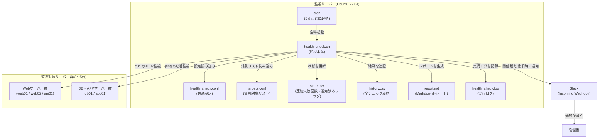
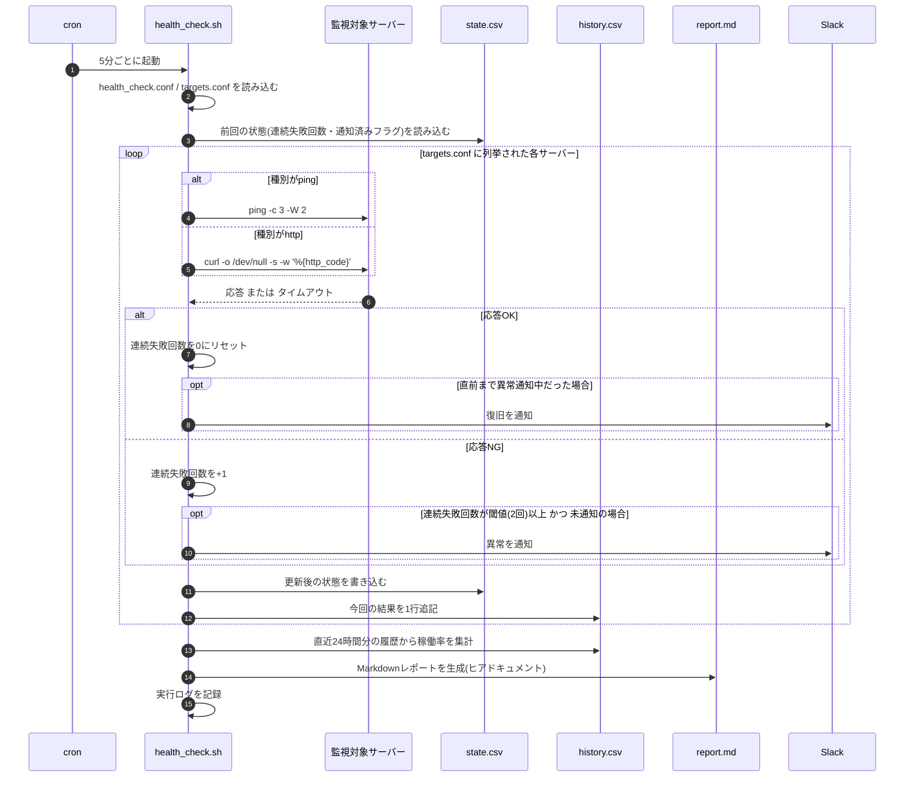

# 02. 設計書

## 1. システム構成

死活監視処理に関わる要素と、それぞれの役割を図で示す。



**構成要素の役割**

| 要素 | 役割 |
|---|---|
| cron | 5分おきに`health_check.sh`を自動起動する「時計係」 |
| health_check.sh | 全対象への疎通確認・状態管理・レポート生成・通知を行う本体スクリプト |
| health_check.conf | 閾値やタイムアウト秒数、通知先などの共通設定を持つファイル(スクリプトと分離) |
| targets.conf | 監視対象サーバーの名前・監視方法・接続先を列挙したファイル(スクリプトと分離) |
| state.csv | 「今どのサーバーが何回連続で失敗しているか」「通知済みかどうか」を覚えておくための状態ファイル |
| history.csv | 毎回のチェック結果をすべて時系列で蓄積する履歴ファイル(稼働率集計の元データ) |
| report.md | 現在の状態と稼働率を一覧できる、自動生成されるMarkdownレポート |
| ログファイル | すべての実行結果を記録し、後から追跡できるようにする |
| Slack Webhook | 異常検知時・復旧時に管理者へリアルタイムで知らせる通知経路 |

## 2. 処理フロー(シーケンス図)

cronから起動されてから、1台のサーバーをチェックする流れと、レポート生成までを示す(`loop`の中身が監視対象の台数分繰り返される)。



## 3. サーバー上のディレクトリ構成

構築先サーバー上の配置は以下の通り(リポジトリ内の`src/`配下のファイルを、この場所へコピーして使う想定)。

```text
/opt/server-health-check/
├── health_check.sh    # 監視本体スクリプト(実行権限 755)
├── health_check.conf  # 共通設定ファイル(権限 600、Webhook URLを含むため)
├── targets.conf       # 監視対象リスト(権限 644)
└── report/
    └── report.md      # 自動生成されるMarkdownレポート

/var/lib/server-health-check/
└── state.csv  # 各サーバーの連続失敗回数・通知済みフラグ(状態ファイル)

/var/log/server-health-check/
├── health_check.log  # health_check.sh自身が出力する実行ログ
├── history.csv       # 全チェック履歴(稼働率集計の元データ)
└── cron.log          # cron経由実行時の標準出力/エラー出力
```

> 💡 `state.csv`(現在の状態)と`history.csv`(過去の全履歴)をあえて別ファイルに分けている理由は、4.3節および6章で解説する。

## 4. 主要な技術要素の解説(初心者向け)

### 4.1 ping(ICMPによる死活監視)

`ping`はネットワーク越しに「相手のサーバーが応答するかどうか」を確認する、もっとも基本的な死活監視コマンド。内部的にはICMP(Internet Control Message Protocol=通信の疎通確認専用に使われるプロトコル)という、Webアクセスなどで使うTCP/HTTPとは別の仕組みを使い、「Echo Request(エコー要求)」というパケットを送って、「Echo Reply(エコー応答)」が返ってくるかどうかで生死を判定する。

```bash
ping -c 3 -W 2 192.168.1.21
```

応答がある場合の出力例:

```text
PING 192.168.1.21 (192.168.1.21) 56(84) bytes of data.
64 bytes from 192.168.1.21: icmp_seq=1 ttl=64 time=0.045 ms
64 bytes from 192.168.1.21: icmp_seq=2 ttl=64 time=0.041 ms
64 bytes from 192.168.1.21: icmp_seq=3 ttl=64 time=0.038 ms

--- 192.168.1.21 ping statistics ---
3 packets transmitted, 3 received, 0% packet loss, time 2034ms
```

応答が無い場合の出力例:

```text
PING 192.168.1.21 (192.168.1.21) 56(84) bytes of data.

--- 192.168.1.21 ping statistics ---
3 packets transmitted, 0 received, 100% packet loss, time 2043ms
```

| オプション | 意味 |
|---|---|
| `-c <回数>` | count。送信するパケット数を指定する。**このオプションを付けないと、`ping`はCtrl+Cで止めるまで永遠に実行され続ける**ため、スクリプトの中で使う場合は必須のオプションになる |
| `-W <秒>` | 応答を待つタイムアウト秒数(Ubuntu標準のiputils-ping実装での意味。実装によって単位や意味が異なる場合がある点に注意) |

`ping`の終了コード(`$?`)は、送信したパケットのうち1つでも応答があれば`0`(成功)、まったく応答が無ければ`0`以外になる。本スクリプトの`check_ping`関数は、この終了コードだけを見て`OK`/`NG`を判定している。

> 💡 なぜ`-c 1`ではなく`-c 3`にしているか: 1回だけ送って、それがたまたまネットワークの瞬間的な揺らぎ(ジッター)でロストした場合、実際には生きているサーバーを「死んでいる」と誤判定してしまう。複数回送ることで、そうした偶発的な失敗の影響を1回のチェックの中である程度吸収している。ただし、これは「1回のチェック内での粘り」であり、次節・4.3節で説明する「cronの実行をまたいだ連続失敗カウント」とは別のレイヤーの仕組みである点に注意する。

### 4.2 curl -o /dev/null -s -w '%{http_code}'(HTTPステータスコードによる死活監視)

Webサーバー・APIサーバーは、ネットワーク的に応答していても(pingが通っても)、アプリケーションが正常に動いているとは限らない。そこで、実際にHTTPリクエストを送り、返ってきた**HTTPステータスコード**を見て正常かどうかを判定する。

```bash
curl -o /dev/null -s -w '%{http_code}' --max-time 5 http://192.168.1.11/
```

出力例(正常時、改行なしで`200`とだけ表示される):

```text
200
```

| オプション | 意味 |
|---|---|
| `-o /dev/null` | レスポンスの中身(HTMLなど)を`/dev/null`(書き込んだものが消える特殊なファイル)へ捨てる。判定に使うのはステータスコードだけなので、本文の中身は不要 |
| `-s` | silent。ダウンロードの進捗バーなど余計な出力を消す |
| `-w '%{http_code}'` | curlの「書式指定出力」機能。レスポンスから該当する値(ここではHTTPステータスコード)だけを取り出して出力する |
| `--max-time <秒>` | 接続開始から応答完了までの合計タイムアウト秒数 |

**HTTPステータスコードの基礎**

| コード帯 | 意味 | 具体例 |
|---|---|---|
| 2xx | 成功 | `200 OK`(正常に処理された) |
| 3xx | リダイレクト | `301 Moved Permanently`(別URLへの転送) |
| 4xx | クライアント側のエラー | `404 Not Found`(指定したページが存在しない) |
| 5xx | サーバー側のエラー | `500 Internal Server Error`(サーバー内部でエラー発生)、`503 Service Unavailable`(一時的に処理できない) |

本スクリプトでは、`targets.conf`で「正常とみなすステータスコード(通常は`200`)」をサーバーごとに指定し、実際に返ってきたコードと**完全一致**するかどうかで`OK`/`NG`を判定する。

サーバーがダウンしていて接続すらできない場合、curlはHTTPステータスコードを受け取れないため、`%{http_code}`の値は`000`という実在しないダミーの値になる。この場合も期待値(`200`など)とは一致しないため、自動的に`NG`と判定される。

> 💡 なぜ`404`や`500`ではダメなのか: `404`や`500`が返ってくるということは、実は「Webサーバー自体(OSやミドルウェア)は動いている」ことを意味する(完全に死んでいれば、そもそも応答すら返らない)。しかし、コンテンツが壊れている・アプリケーションにバグがあるなどの理由で「正しいページが表示できていない」状態であり、利用者から見れば「使えない」障害には変わりない。だからこそ、「応答が返るかどうか」だけでなく「期待通りのステータスコード(`200`)が返るかどうか」まで確認することに意味がある。

### 4.3 状態ファイルを使った連続失敗カウント(フラッピング対策と「閾値」の考え方)

一時的な通信の揺らぎ(ネットワーク機器の瞬断、サーバーの一瞬の高負荷など)によって、実際には正常なサーバーが「たまたま1回だけ」チェックに失敗することがある。これを「1回失敗した瞬間に即座に異常通知を送る」設計にしてしまうと、些細な揺らぎのたびに管理者へ通知が飛び、本当に重要な通知を見逃す「オオカミ少年」状態になりかねない。この、状態がOK/NGを不安定に行ったり来たりする現象を、監視の世界では**フラッピング(flapping)**と呼ぶ。

これを防ぐために導入しているのが「**閾値(threshold)**」という考え方である。閾値とは、「これを超えたらはじめて異常とみなす」という基準値のことで、本ツールでは`FAIL_THRESHOLD`(既定2回)がそれにあたる。

判定の流れを整理すると、以下のようになる。

```text
もし 今回のチェックがOK なら:
    連続失敗回数を 0 にリセットする
そうでなければ(NGなら):
    連続失敗回数を +1 する

もし 連続失敗回数 >= 閾値(2) かつ まだ通知していない なら:
    → 異常として通知する(このタイミングで1回だけ)
もし 今回OK かつ 直前まで通知中だった なら:
    → 復旧として通知する
```

このロジックを実現するには、「前回チェックした時点でどうだったか」を覚えておく必要がある。しかし、cronは5分ごとに`health_check.sh`という**互いに独立した別プロセス**を起動するため、プログラムの中の変数だけでは前回の結果を覚えておくことができない。そこで、状態を`state.csv`というファイルに書き出し、次回の実行時に読み込んで引き継ぐ、という方法で「記憶」を実現している。

`state.csv`の中身の例:

```text
web01,OK,0,no
web02,NG,1,no
db01,NG,3,yes
```

各列は「サーバー名、直近のチェック結果、連続失敗回数、通知済みフラグ(yes/no)」を表す。

> 💡 閾値を大きくしすぎるとどうなるか: 例えば閾値を10回(5分間隔なら50分間)にすると誤検知は減るが、その分「本当に障害が起きてから気づくまでの時間」が延びてしまう。逆に閾値を1回にすると、誤検知が増えて通知の信頼性が下がる。「誤検知を防ぐこと」と「早く気づくこと」はトレードオフの関係にあり、監視対象の特性(ネットワークが不安定な環境か、安定した環境か)に応じてこの値を調整するのが実務での勘所になる。

### 4.4 cron(5分ごとの定期実行)

`cron`はLinuxで「指定した時刻に、指定したコマンドを自動実行する」ための仕組み(=何を意味するか: 決まったスケジュールで処理を自動実行する、Linux標準のスケジューラ)。`crontab -e`コマンドで、実行ユーザーごとの予定表(crontab)を編集する。

```text
分 時 日 月 曜日 実行するコマンド
*/5  *  *  *  *   /opt/server-health-check/health_check.sh
```

| フィールド | 指定範囲 | 今回の値 | 意味 |
|---|---|---|---|
| 分 | 0〜59 | `*/5` | 5で割り切れる分(0, 5, 10, ..., 55)ごと |
| 時 | 0〜23 | `*` | 毎時間(指定なし) |
| 日 | 1〜31 | `*` | 毎日(指定なし) |
| 月 | 1〜12 | `*` | 毎月(指定なし) |
| 曜日 | 0〜7(0と7は日曜) | `*` | 毎曜日(指定なし) |

`*/N`は「Nおきに」を表すcronの書き方(ステップ値)で、`0,5,10,15,20,25,30,35,40,45,50,55 * * * *`と書くのと同じ意味になる。

> 💡 なぜ5分間隔なのか: 間隔を短くするほど障害に早く気づけるが、その分チェック自体の負荷や通知の頻度も増える。5分間隔・閾値2回という組み合わせであれば、「最短で10分以内に異常を検知できる」バランスになる(詳細は6章)。

### 4.5 ヒアドキュメントを使ったMarkdownレポート組み立て

ヒアドキュメント(=`<<EOF` 〜 `EOF`のように、複数行の文字列をまとめて扱う書き方)を使うと、`echo`を何度も書かずに、複数行のテキストを1つの塊として出力できる。

```bash
cat > report.md <<EOF
# レポート
- 生成日時: ${NOW}
EOF
```

出力例(`report.md`の中身):

```text
# レポート
- 生成日時: 2026-08-31 13:38:18
```

| 記法 | 意味 |
|---|---|
| `<<EOF` 〜 `EOF` | ヒアドキュメント。`EOF`(終端の目印。任意の文字列でよい)で挟まれた複数行を、まとめて1つの文字列として扱う |
| `<<EOF`(クォートなし) | 中に書いた`${変数}`が実際の値に展開される |
| `<<'EOF'`(シングルクォートで囲む) | 中の`${変数}`をそのままの文字列として扱う(展開されない) |
| `cat > file <<EOF ... EOF` | ファイルを新規作成(既存の内容があれば上書き) |
| `cat >> file <<EOF ... EOF` | ファイルの末尾に追記 |

本スクリプトでは、レポートの見出しや表のヘッダーなど「固定文言の部分」はヒアドキュメントでまとめて書き出し、サーバーごとに内容が変わる「表の行」は`for`ループの中で`echo "..." >> "$REPORT_FILE"`を使って1行ずつ追記する、という組み合わせにしている。ヒアドキュメントの手軽さと、ループによる動的な行生成を両立させる、シェルスクリプトでのレポート生成でよく使われるパターン。

### 4.6 awk / date を使った稼働率の集計(発展要件)

`awk`はテキストを行・列(フィールド)単位で処理するのに特化したコマンド(=何を意味するか: CSVのような区切り文字付きテキストを、集計・加工するためのミニ言語)。`history.csv`から「直近24時間・特定のサーバー名」の行数を数えることで稼働率を算出する。

```bash
date -d "-24 hours" '+%Y-%m-%d %H:%M:%S'
```

出力例(実行時刻から24時間前の日時):

```text
2026-08-30 13:38:18
```

```bash
awk -F',' -v name="web01" -v since="2026-08-30 13:38:18" \
    '$2 == name && $1 >= since { c++ } END { print c + 0 }' history.csv
```

| 部品 | 意味 |
|---|---|
| `-F','` | 区切り文字(フィールドセパレータ)をカンマに指定する |
| `-v name="web01"` | シェル変数の値をawkの内部変数として渡す |
| `$1`, `$2`, ... | カンマで区切った1列目・2列目・...を指す(`history.csv`なら`$1`=timestamp、`$2`=name) |
| `{ c++ }` | 条件に一致した行が来るたびに、変数`c`を1増やす |
| `END { print c + 0 }` | 全行の処理が終わったあとに1回だけ実行される。該当行が1件も無く`c`が未定義のままだと空文字になってしまうため、`+ 0`を足すことで確実に数値の`0`として出力させている |

> 💡 なぜ`$1 >= since`という文字列比較だけで日時の前後判定ができるのか: `history.csv`のタイムスタンプは`"2026-08-31 13:38:18"`のように、必ず「年→月→日→時→分→秒」の順で、桁数を揃えて(0埋めして)記録している。この形式であれば、文字列としてアルファベット順(辞書式)に並べても、それがそのまま時系列の古い順・新しい順と一致する。日時を扱う際にこの形式(ISO 8601に近い形式)を使っておくと、複雑な日時計算ライブラリを使わなくても、単純な文字列比較だけで前後関係を判定できるという実務上の利点がある。

### 4.7 curlとSlack Incoming Webhookによる通知

異常検知時・復旧時にSlackへ通知する`notify_slack`関数は、`curl`でSlackの「Incoming Webhook」というURLへHTTPのPOSTリクエストを送るだけの、シンプルな仕組みで実装している。

```bash
curl -s -X POST -H 'Content-type: application/json' \
    --data '{"text": "🔴 [障害検知] down-web(http://192.168.1.11/)が2回連続でNGです"}' \
    "<YOUR_SLACK_WEBHOOK_URL>"
```

**Webhook(ウェブフック)とは**、あるサービス(ここではSlack)があらかじめ発行した専用のURLへ、決まった形式のデータをHTTPで送るだけで、そのサービス側で何か(ここではメッセージ投稿)が起こる仕組みのこと。Slackでは「Incoming Webhook」という機能を有効にすると、通知先チャンネルごとに専用のURLが発行され、そのURLへ**JSON**(=`{"text": "..."}`のように、キーと値の組でデータを表す軽量なテキスト形式)形式のデータをPOSTするだけで、指定したチャンネルにメッセージが投稿される。IDやパスワードによるAPI認証の手続きが不要なため、外部サービスとの連携を手早く実装できる。

| オプション | 意味 |
|---|---|
| `-X POST` | HTTPの`POST`メソッド(サーバーへデータを送信するリクエスト)を明示的に指定する |
| `-H 'Content-type: application/json'` | 送信するデータの形式がJSONであることをサーバー側に伝えるヘッダー |
| `--data '...'` | 実際に送信するデータ本体(ここではJSON形式のメッセージ) |

`notify_slack`関数では、`health_check.conf`の`ENABLE_SLACK_NOTIFY`が`false`の場合は何もせずに返る(`return 0`)ようにしており、Slackの準備が整っていない検証段階でも、通知処理だけをスキップしてログ記録・レポート生成の動作確認を先に進められるようにしている。また、`curl`自体の戻り値はあえてチェックしていない(NFR-01と同じ考え方で、通知の失敗が監視処理全体を止めないようにするため)。

## 5. 状態遷移(1台のサーバーに着目した例)

`FAIL_THRESHOLD=2`のとき、あるサーバーが「OK→NG→NG→NG→OK」と推移した場合の`state.csv`・通知の様子を示す。

| 実行回 | 結果 | 連続失敗回数 | 通知済みフラグ | 通知の有無 |
|---|---|---|---|---|
| 1回目 | OK | 0 | no | なし |
| 2回目 | NG | 1 | no | なし(まだ閾値未満=様子見) |
| 3回目 | NG | 2 | yes | **異常を通知**(閾値に到達した瞬間) |
| 4回目 | NG | 3 | yes | なし(すでに通知済みのため連発しない) |
| 5回目 | OK | 0 | no | **復旧を通知**(通知中の状態からOKに戻った) |

もし2回目の直後(3回目)に運良くOKへ戻った場合は、閾値(2回)に達していないため異常通知は送られず、当然「復旧」通知も送られない。この「そもそも異常と判定していないものは、復旧とも言わない」という対称性が、通知の信頼性を保つポイントになる。

## 6. あえてこの設計にした理由(設計判断のメモ)

- **状態(`state.csv`)と履歴(`history.csv`)を分けている**: `state.csv`は「今この瞬間、各サーバーがどうなっているか」だけを保持する軽量なファイルで、毎回内容を丸ごと書き換える。一方`history.csv`は「稼働率を計算するための時系列データ」として、追記のみを行い過去のレコードを蓄積し続ける。役割(現在の状態管理 / 過去の集計用データ)が異なるため、あえてファイルを分離した。
- **`state.csv`は一時ファイル経由で`mv`する**: 処理の途中でスクリプトが強制終了しても、書きかけの不完全な内容で`state.csv`が上書きされてしまう事故を防ぐため、いったん`mktemp`で作った一時ファイルに全件書き出してから、最後に`mv`で本来のファイルに置き換えている(NFR-02のべき等性・堅牢性に対応)。
- **`FAIL_THRESHOLD=2`・5分間隔という初期値**: 5分間隔で2回連続を条件にすると、最短でも「発生から10分以内」には異常を検知できる。これは「頻繁すぎる誤通知を避けたい」という要求と、「気づくのが遅すぎても困る」という要求のバランスを取った初期値であり、環境に応じて`health_check.conf`の値を調整することを前提にしている。
- **`set -e`ではなく各コマンドの終了コードを個別にチェックする方針**: 1台のサーバーへの`ping`や`curl`が失敗しても、そこでスクリプト全体を止めてしまうと、残りのサーバーのチェックやレポート生成まで実行されなくなる。案件No.2(バックアップ自動化)と同じ考え方で、「一部の失敗が全体を止めない」設計を優先している。
