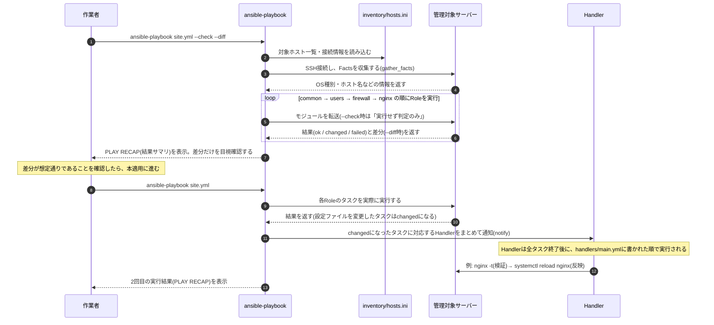
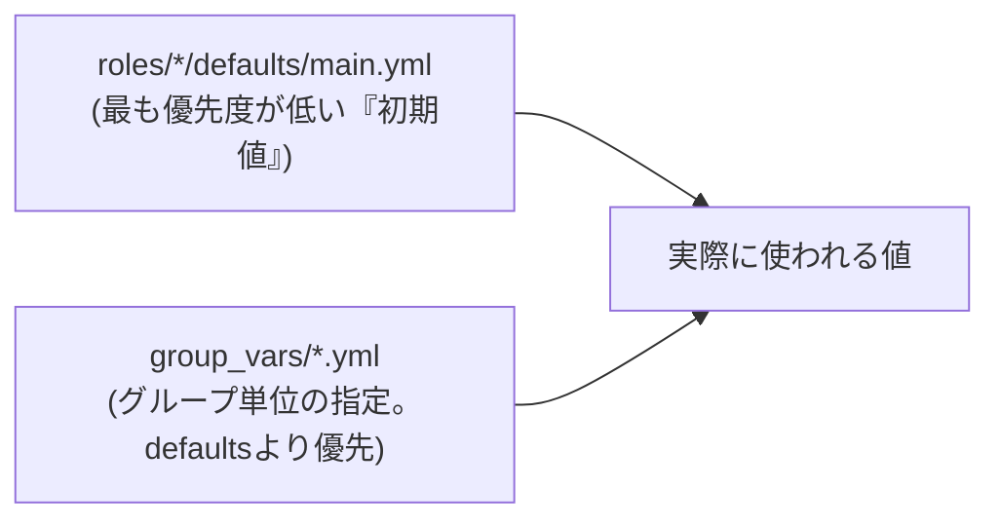
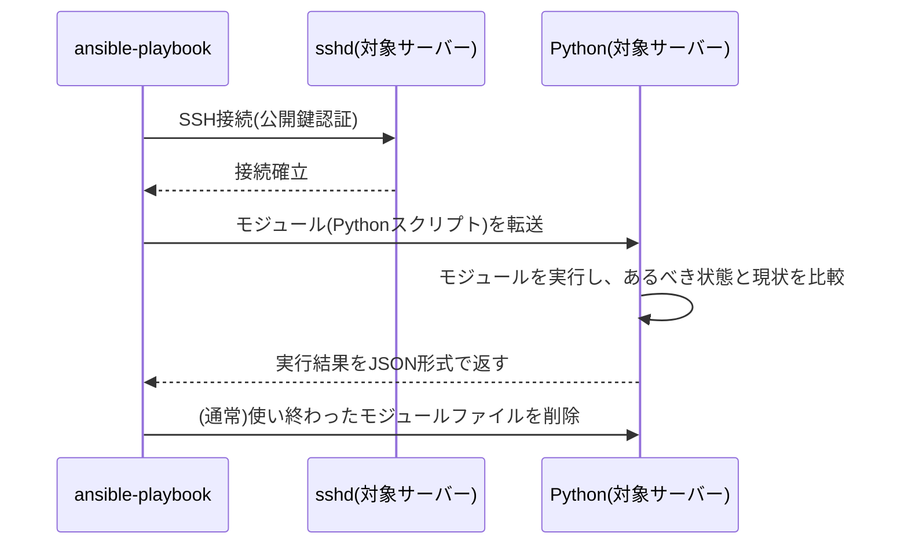

# 02. 設計書

## 1. システム構成

Ansibleによる自動構築に関わる要素と、それぞれの役割を図で示す。

```mermaid
flowchart LR
    subgraph Control["コントロールノード(作業PC)"]
        CFG["ansible.cfg\n(動作設定)"]
        INV["inventory/hosts.ini\n(対象サーバー一覧)"]
        VARS["group_vars/\n(変数定義)"]
        PB["site.yml\n(Playbook)"]
        ROLES["roles/\ncommon / users / firewall / nginx"]
        CLI["ansible-playbook\nコマンド"]
    end

    subgraph Web01["web01(Ubuntu 22.04)"]
        SSH1["sshd"]
        PY1["Python3\n(モジュール実行)"]
    end

    subgraph Web02["web02(AlmaLinux 9)"]
        SSH2["sshd"]
        PY2["Python3\n(モジュール実行)"]
    end

    INV --> CLI
    VARS --> CLI
    PB --> CLI
    ROLES --> PB
    CFG -.->|接続設定・動作設定を参照| CLI
    CLI -->|SSH接続(鍵認証)| SSH1
    CLI -->|SSH接続(鍵認証)| SSH2
    SSH1 --> PY1
    SSH2 --> PY2
    PY1 -->|タスク実行結果をJSONで返す| CLI
    PY2 -->|タスク実行結果をJSONで返す| CLI
```

**構成要素の役割**

| 要素 | 役割 |
|---|---|
| ansible.cfg | Inventoryの場所やSSH接続時の挙動など、Ansible全体の動作を設定するファイル |
| inventory/hosts.ini | 「どのサーバーに」処理を行うかを定義する一覧ファイル |
| group_vars/ | ホストグループ単位で使う変数(ユーザー名・タイムゾーン等)をまとめたファイル群 |
| site.yml(Playbook) | 「対象ホスト」と「適用するRoleの順番」を定義する、実行の入口となるファイル |
| roles/ | common・users・firewall・nginxの4つに分割された、実際の処理内容 |
| ansible-playbookコマンド | 上記をすべて読み込み、対象サーバーへSSH接続して処理を実行するコマンド |
| sshd(対象サーバー側) | SSH接続を受け付けるサービス。Ansibleはこの標準的なSSH接続を使って対象サーバーに入る |
| Python3(対象サーバー側) | Ansibleが転送したモジュール(Pythonスクリプト)を実行する処理系。対象サーバー側に必須の唯一の前提条件 |

> 💡 **なぜエージェントレス(=専用の常駐プログラム不要)と言えるのか**
> 監視ツールなどでは「対象サーバーに専用のエージェントソフトを事前インストールしておく」方式がよくあるが、Ansibleは違う。対象サーバー側に必要なのは「SSHサーバー」と「Python」という、Linuxサーバーであればほぼ標準で入っているものだけ。Ansibleは実行のたびにSSH経由でモジュール(処理内容を書いたPythonスクリプト)を対象サーバーに一時的に転送し、実行し、結果を受け取ったら消す、という動き方をする。事前に何かを常駐させておく必要がないため「エージェントレス」と呼ばれる。

## 2. 処理フロー(シーケンス図)

`ansible-playbook site.yml --check --diff`(dry run)を実行してから、問題なければ`ansible-playbook site.yml`(本適用)を実行する、という一連の流れを示す。



**この図で押さえておきたいポイント**

- `--check`(dry run)モードでは、実際にはサーバーへ変更を加えず「変更が発生するかどうか」だけを判定する。まず`--check --diff`で影響範囲を確認してから本適用する、という2段階の運用フローが実務の基本になる。
- Handlerは「タスクの実行中」ではなく、「対象ホストの全タスクが終わったあと」にまとめて実行される。しかも複数回notifyされても実行は1回だけにまとめられる(例: nginxの設定ファイルを2つ変更しても、reloadは1回で済む)。

## 3. べき等性の考え方(図解)

同じPlaybookを1回目・2回目と続けて実行したときの状態遷移を示す。

```mermaid
flowchart TD
    A["初期状態\n(まっさらなサーバー)"] -->|1回目の実行| B["望ましい状態\nNginx導入・設定済み"]
    B -->|2回目の実行\n(変更なし)| B
    C["誰かが手動でindex.htmlを書き換えた"] -->|再実行| B
    B -->|1回目の実行と同じPlaybookを\n何度実行しても| B
```

- 1回目の実行では、Nginxが未導入の状態から「望ましい状態」まで変化するので、多くのタスクが`changed`になる。
- 2回目の実行では、すでに望ましい状態に達しているため、`changed`は0件(すべて`ok`)になるはずである。これが「べき等性が保たれている」ことの確認方法になる。
- 仮に誰かが手動でサーバー上のファイルを書き換えてしまっても(設定ドリフト、と呼ばれる)、Playbookを再実行すれば「あるべき状態」に戻すことができる。これがIaCの大きなメリットの1つで、「サーバーの状態をコードで管理する」ことの実務的な価値になる(03-build-guide.md Step 14で実際に確認する)。

## 4. src/ ディレクトリ構成

```text
src/
├── ansible.cfg                 # Ansibleの動作設定
├── requirements.yml             # 使用するAnsible Collectionの定義
├── site.yml                     # 入口となるPlaybook
├── verify.sh                    # 構築後の検証スクリプト
├── inventory/
│   └── hosts.ini                # 対象サーバー一覧(Inventory)
├── group_vars/
│   ├── all.yml                  # 全ホスト共通の変数
│   └── webservers.yml           # webserversグループ用の変数
├── files/
│   └── webadmin_id_ed25519.pub.example   # SSH公開鍵ファイルのサンプル
└── roles/
    ├── common/                  # 共通初期設定(パッケージ・タイムゾーン)
    │   ├── defaults/main.yml    #   Roleのデフォルト変数
    │   └── tasks/main.yml       #   実際の処理内容
    ├── users/                   # 作業用ユーザー・SSH鍵・パスワード認証無効化
    │   ├── defaults/main.yml
    │   ├── tasks/main.yml
    │   └── handlers/main.yml
    ├── firewall/                # ファイアウォール設定(OSごとに分岐)
    │   ├── defaults/main.yml
    │   └── tasks/
    │       ├── main.yml         #   OS判定してDebian.yml/RedHat.ymlに振り分け
    │       ├── Debian.yml       #   ufwの設定
    │       └── RedHat.yml       #   firewalldの設定
    └── nginx/                   # Nginxインストール・設定・静的ページ公開
        ├── defaults/main.yml
        ├── tasks/main.yml
        ├── handlers/main.yml
        └── templates/
            ├── nginx.conf.j2    #   バーチャルホスト設定のテンプレート
            └── index.html.j2    #   公開する静的ページのテンプレート
```

## 5. 主要な技術要素の解説(初心者向け)

### 5.1 YAML(YAML Ain't Markup Language)のインデントルール

AnsibleのPlaybook/Role/変数は、すべてYAMLという記法で書く。YAMLは「インデント(字下げ)」で階層構造を表現するフォーマットで、JSONのように`{}`や`,`を使わない代わりに、**インデントの空白数を正確に揃える必要がある**。

```yaml
# 正しい例
- name: パッケージをインストールする
  ansible.builtin.package:
    name: nginx
    state: present
```

```text
- name: ...          ← リストの1項目(タスク1つ分)。行頭の "- " がリストを表す
  ansible.builtin.package:   ← "name:" と同じ階層(インデント2つ分)
    name: nginx              ← package: の中身(さらに1段階深いインデント)
    state: present
```

| ルール | 内容 |
|---|---|
| インデントは**半角スペース**のみ | タブ文字は使えない(エディタの設定でタブが自動的にスペースに変換されるようにしておくと安全) |
| 同じ階層は同じインデント幅で揃える | 1つのマッピング(辞書)内で、キーの開始位置が1文字でもズレるとエラーになる |
| リストは`- `(ハイフン+半角スペース)で表す | `common_packages:` の下に`- vim`のように書くと「vimを含むリスト」になる |
| 辞書(マッピング)は`キー: 値`で表す | `state: present`のように、コロンの後に半角スペースを1つ入れる |

> 💡 インデントのズレはYAMLで最もハマりやすいポイント。`mapping values are not allowed in this context`のようなエラーが出たら、まずインデントのスペース数がその行の前後で揃っているかを疑う(詳しくは05-troubleshooting.md Q1)。

### 5.2 Playbookの基本構造(hosts / tasks / handlers)

Playbook(`site.yml`)は、大きく分けて「どのホストに」「何をするか」を書くファイル。

```yaml
- name: Webサーバーの初期構築を自動化する
  hosts: webservers      # ① 対象ホスト(Inventoryのグループ名を指定)
  become: true            # ② root権限(sudo)で実行するかどうか
  gather_facts: true      # ③ OS種別などの情報を事前に収集するか

  roles:                  # ④ 適用するRoleの一覧(順番に実行される)
    - role: common
    - role: users
    - role: firewall
    - role: nginx
```

| 項目 | 意味 |
|---|---|
| `hosts:` | Inventoryで定義したグループ名(または個別ホスト名)。今回は`webservers`グループ全体が対象 |
| `become:` | `true`にすると、一般ユーザーで接続してもタスクは`sudo`で昇格して実行される |
| `gather_facts:` | `true`(デフォルト)にすると、実行開始時に対象サーバーのOS種別・ホスト名・IPアドレス等を自動収集し、`ansible_facts`という変数に格納してくれる。この案件ではOS判定(Debian系/RedHat系の分岐)にこの機能を使っている |
| `roles:` | このPlayが実行するRoleの一覧。上から順に適用される |

Role自体は、`tasks/main.yml`に「実際に行う処理」を、`handlers/main.yml`に「変更があったときだけ行う後処理」を、`defaults/main.yml`に「変数の初期値」を、それぞれ役割ごとのファイルに分けて書く。この分割によって、1つのファイルが肥大化せず、見通しよく管理できる。

### 5.3 Inventory(対象サーバーの一覧)

Inventoryは「Ansibleがどのサーバーに接続するか」を定義するファイル。今回はINI形式(`hosts.ini`)で記述している。

```ini
[webservers]
web01 ansible_host=192.0.2.10
web02 ansible_host=192.0.2.11

[webservers:vars]
ansible_user=root
ansible_ssh_private_key_file=~/.ssh/id_ed25519_bootstrap
```

`[webservers]`という「グループ名」でホストをまとめておくことで、Playbook側では1台ずつホスト名を書く代わりに`hosts: webservers`と書くだけで、グループに属する全ホストへ一括で処理を適用できる。サーバーが増えても、Inventoryに1行追加するだけで対応できる点が、手作業運用との大きな違いになる。

### 5.4 Role(役割ごとのコード分割)

Roleは、Playbookのタスクを「役割ごとにディレクトリで分割する」ための仕組み。今回は要件通り、以下の4つに分割した。

| Role名 | 責務 |
|---|---|
| common | どのサーバーにも共通の初期設定(パッケージ導入・タイムゾーン) |
| users | 作業用一般ユーザーの作成・SSH公開鍵の配置・パスワード認証の無効化 |
| firewall | ファイアウォール設定(OSに応じてufw/firewalldを使い分け) |
| nginx | Nginxのインストール・設定・静的ページの公開 |

Roleに分割するメリットは、**再利用性**と**見通しの良さ**にある。例えば「Nginxだけを別の新しいサーバーにも入れたい」という要望が来た場合、`nginx` Roleだけを別のPlaybookから呼び出せば済む。また、1つのタスクファイルに全処理を詰め込むよりも、「ファイアウォールの設定を見たいならfirewall Roleを見ればよい」という探しやすさが生まれる。

### 5.5 変数の優先順位(defaults と group_vars)

Ansibleの変数は複数の場所で定義でき、それぞれ優先順位が決まっている。今回使っている範囲では、以下の関係を押さえておけば十分。



例えば`deploy_user_name`という変数は`roles/users/defaults/main.yml`で`webadmin`という初期値を持っているが、`group_vars/all.yml`でも同じ変数名で値を定義している。この場合、**group_varsの値が優先される**。defaultsは「Role単体でも動くようにするための最低限の初期値」、group_varsは「このプロジェクトとしての実際の設定値」という役割分担になっている。

### 5.6 Jinja2テンプレート(nginx.conf.j2)

`template`モジュールを使うと、`{{ 変数名 }}`という書き方(Jinja2というテンプレートエンジンの記法)を埋め込んだファイルを用意しておき、実行時に実際の値へ置き換えて配置できる。

```jinja
server {
    listen {{ nginx_listen_port }} default_server;
    server_name {{ nginx_server_name }};
    root {{ nginx_document_root }};
    ...
}
```

```nginx
server {
    listen 80 default_server;
    server_name _;
    root /var/www/html;
    ...
}
```

設定ファイルをコピー(`copy`モジュール)するだけでは、サーバーごとに違う値(ポート番号やドキュメントルート)を切り替えられない。`template`モジュールとJinja2を使うことで、「1つのひな形ファイル」から「サーバーごとに異なる実際の設定ファイル」を生成できる。今回は`index.html.j2`でも、`ansible_facts`(自動収集したホスト名やOS情報)をページ内に埋め込んで、「どのサーバーが応答しているか」が見て分かるようにしている。

### 5.7 Handlers(変更があったときだけ動く後処理)

```yaml
- name: Nginxのバーチャルホスト設定を配置する
  ansible.builtin.template:
    src: nginx.conf.j2
    dest: /etc/nginx/conf.d/portfolio-site.conf
  notify:
    - Validate nginx config
    - Reload nginx
```

`notify:`に指定した名前のHandlerは、このタスクが`changed`(変更あり)になったときだけ呼び出される。設定ファイルに変化がなければ、Nginxの再読込(reload)自体も発生しない。「変更が無いのに毎回サービスを再起動する」といった無駄がなく、かつ「変更したのに反映を忘れる」というミスも防げる。

> 💡 Handlerは**notifyされた順番ではなく、`handlers/main.yml`に書かれている順番**で実行される。今回のnginx Roleでは、`Validate nginx config`(nginx -tによる文法チェック)を`Reload nginx`より上に書くことで、「壊れた設定のままreloadしてしまう」事故を防いでいる。

### 5.8 SSH接続の仕組みとエージェントレスの意味

Ansibleは対象サーバーに接続する際、特別なプロトコルを使わず、**通常のSSH接続をそのまま使う**。流れを整理すると以下のようになる。



対象サーバー側に必要な前提条件は「SSHサーバーが動いていること」と「Pythonがインストールされていること」の2つだけ。専用のエージェントを事前に配布・インストールする必要がないため、「新しいサーバーが増えたら、Inventoryに追記してSSH鍵さえ渡せばすぐ管理対象にできる」という手軽さにつながっている。

### 5.9 `ansible-playbook --check` / `--diff`(dry run)

```bash
ansible-playbook site.yml --check --diff
```

| オプション | 意味 |
|---|---|
| `--check` | 実際には変更を加えず、「このタスクを実行したら変更が発生するか(changedになるか)」だけを判定する(dry run) |
| `--diff` | ファイルの内容を変更するタスク(`template`/`copy`等)について、変更前後の差分を表示する |

`--check`モードは「本当に実行して大丈夫か」を事前に確認するための機能で、特に本番サーバーに対して実行する前には必須の確認手順になる。ただし全モジュールが完全に`--check`に対応しているわけではない点には注意が必要(詳細は05-troubleshooting.md Q8、04-test-plan.mdのテストケースを参照)。

### 5.10 OSによる処理の分岐(ansible_facts)

```yaml
- name: Debian系(ufw)向けのファイアウォール設定を実行する
  ansible.builtin.include_tasks: Debian.yml
  when: ansible_facts['os_family'] == "Debian"
```

`gather_facts: true`によって収集された`ansible_facts`には、`os_family`(Debian系かRedHat系か)、`distribution`(具体的なディストリビューション名)、`hostname`などの情報が入っている。`when:`条件と組み合わせることで、「Ubuntu/DebianではA、AlmaLinux/RHELではB」というOSごとの処理分岐を、1つのPlaybookの中で自然に書ける。今回のfirewall Roleでは、この仕組みを使って`ufw`(Debian系)と`firewalld`(RedHat系)を切り替えている。

### 5.11 Ansible Collection(ansible.posix / community.general)

Ansible本体(`ansible-core`)には最低限のモジュールしか含まれておらず、SSH公開鍵管理(`authorized_key`)やfirewalld操作(`firewalld`)、ufw操作(`ufw`)などは「Collection」という追加パッケージとして別途インストールする必要がある。

```bash
ansible-galaxy collection install -r requirements.yml
```

`requirements.yml`に必要なCollectionを一覧化しておくことで、他の人が同じ環境を再現する際も、このコマンド1つで必要なモジュールを揃えられる(これもIaCの一部。「何が必要か」がコードとして残る)。

## 6. あえてこの設計にした理由(設計判断のメモ)

- **firewall Roleをport番号(ufw)/service名(firewalld)で分けて書いた**: ufwの「アプリケーションプロファイル」(`Nginx Full`等)はnginxパッケージが登録するものであり、Role実行順序(firewall→nginx)によっては「プロファイルが見つからない」エラーになる。ポート番号による指定にすることで、Roleの実行順序に依存しない、堅牢な書き方にしている。
- **`/etc/nginx/conf.d/`にバーチャルホスト設定を配置した**: Ubuntu・AlmaLinuxのどちらのnginxパッケージも、標準の`nginx.conf`から`conf.d/*.conf`を読み込む設定になっている。この場所を使うことで、OSごとに配置先を分岐させる必要がなくなり、nginx Role自体をOS非依存のシンプルな作りに保てる。
- **SSHロックダウン(パスワード認証・root直接ログインの無効化)にタグを分離した**: 自動化の怖さは「一気に全部適用してしまうこと」にある。鍵の配置ミスに気づかないままパスワード認証まで無効化すると、サーバーに一切入れなくなる。`ssh_lockdown`タグで分離し、途中で人が確認するステップを挟めるようにしている。
- **Handlerで`nginx -t`(検証)を`reload`(反映)より先に実行する**: 設定ミスのある状態のままreloadすると、最悪の場合サービスが起動しなくなる。壊れた設定を検知した時点で気づけるよう、検証と反映を分離している。
