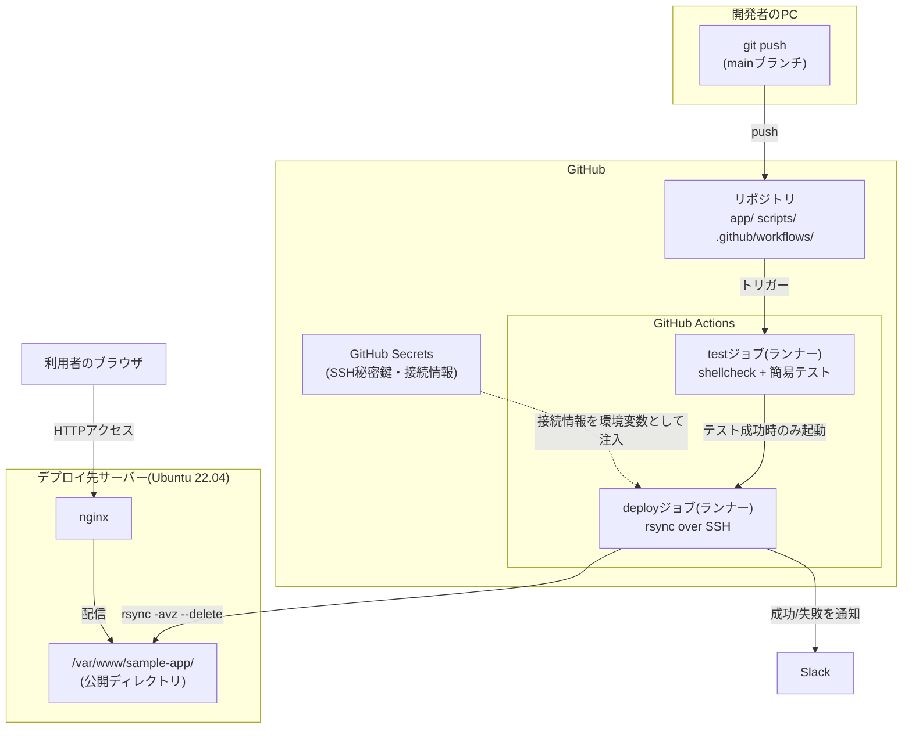
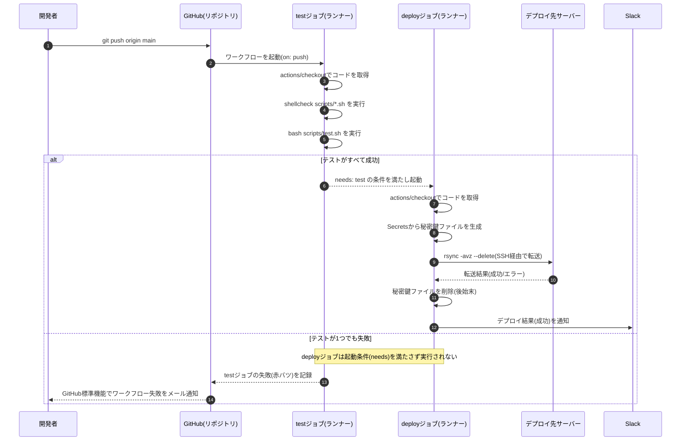

# 02. 設計書

## 1. システム構成

CI/CDパイプラインに関わる要素と、それぞれの役割を図で示す。



**構成要素の役割**

| 要素 | 役割 |
|---|---|
| リポジトリ | アプリのコード(`app/`)・テストスクリプト(`scripts/`)・ワークフロー定義(`.github/workflows/`)を管理する |
| GitHub Secrets | SSH秘密鍵や接続先ホスト名など、コードに書けない機密情報を暗号化して保存する場所 |
| GitHub Actions(testジョブ) | pushやpull_requestのたびに使い捨てで起動する仮想マシン(ランナー)上で、shellcheckと簡易テストを実行する |
| GitHub Actions(deployジョブ) | testジョブが成功した場合に限り起動し、Secretsから受け取った接続情報でデプロイ先サーバーへrsync転送する |
| デプロイ先サーバー | 実際にアプリを配信するサーバー。SSHでの受け入れ準備(専用ユーザー・公開鍵登録)をしておく |
| nginx | 配置されたファイル(`app/`の中身)をWebとして配信するソフトウェア |
| Slack | デプロイジョブの成功/失敗を、担当者全員がすぐに把握できるよう通知する先 |

> 💡 案件No.1〜No.5との大きな違い: これまでの案件は「1台のサーバー上で完結するスクリプト・サービス」を構築するものだったが、今回構築するのは**GitHubのクラウド上で動く自動化の仕組み**そのもの。ランナー(仮想マシン)はジョブのたびに新しく用意され、終わったら消える「使い捨て」の環境である点が特徴的。

## 2. 処理フロー(シーケンス図)

`main`ブランチへpushしてから、テスト→デプロイ→通知までの一連の流れを示す。



## 3. トリガーによる挙動の違い(決定フロー)

「push」「pull_request」といったトリガーの種類と、対象ブランチによってワークフローの挙動がどう変わるかを図で整理する(4.3節で詳しく解説)。

```mermaid
flowchart TD
    EVENT["GitHubリポジトリでイベント発生"] --> Q1{"イベントの種類は?"}
    Q1 -->|push| Q2{"pushされたブランチは?"}
    Q1 -->|pull_request| Q4{"マージ先ブランチは?"}
    Q1 -->|それ以外\n(issueコメント等)| SKIP1["対象外\nワークフローは起動しない"]

    Q2 -->|main| RUN_ALL["test → deploy を実行\n(CI + CD)"]
    Q2 -->|main以外\n(featureブランチ等)| SKIP2["起動しない\non.push.branchesの対象外のため"]

    Q4 -->|main向け| RUN_TEST["testジョブのみ実行\n(deployは実行しない)"]
    Q4 -->|main以外向け| SKIP3["起動しない\non.pull_request.branchesの対象外のため"]
```

## 4. 主要な技術要素の解説(初心者向け)

### 4.1 CI(継続的インテグレーション)とCD(継続的デリバリー/デプロイ)の違い

**CI(Continuous Integration=継続的インテグレーション)** とは、コードの変更を1つのブランチ(通常は`main`)へ頻繁に取り込みながら、そのたびに**自動でビルド・テストを実行し、問題を早期に発見する**という開発手法・仕組みのこと。本ワークフローの`test`ジョブ(shellcheck+簡易テスト)がこれにあたる。

**CD**には、実は少し意味の異なる2つの言葉が存在する。

| 用語 | 正式名称 | 意味 |
|---|---|---|
| Continuous Delivery(継続的デリバリー) | 同じ「CD」 | テストを通過した変更を、**いつでもリリースできる状態まで自動で準備する**こと。本番への反映は人間が最終ボタンを押す(承認する)運用も含む |
| Continuous Deployment(継続的デプロイ) | 同じ「CD」 | テストを通過した変更を、**人の承認を挟まず自動的に本番まで反映する**こと |

本案件で構築するパイプラインは、`main`ブランチへのpush→テスト成功→**人の承認なしに自動でサーバーへ反映**という流れのため、厳密には**Continuous Deployment(継続的デプロイ)**にあたる。「CI/CD」とまとめて呼ばれることが多いが、「テストの自動化(CI)」と「反映の自動化(CD)」は別々の工程であり、`needs: test`という設定によって初めて「テストが通ったものだけを反映する」という形でつながっている、という理解が重要になる。

> 💡 なぜ承認なしの自動デプロイ(Continuous Deployment)にしたのか: 依頼内容が「pushしたら自動でテスト・デプロイされる仕組み」だったため。より慎重な運用にしたい場合は、GitHub Environments機能で「本番環境への反映前に、指定した人の承認を必須にする」という設定を追加できる(6章で発展的に触れる)。

### 4.2 GitHub Actionsワークフローの基本構造(on / jobs / steps)

GitHub Actions(=GitHubが提供する、リポジトリのイベントをきっかけに自動処理を実行できるCI/CDサービス)のワークフローは、リポジトリの`.github/workflows/`ディレクトリに置いたYAML(=インデント(字下げ)の深さで階層構造を表現する、設定ファイルによく使われる記法)ファイル1つ1つが「1つの自動化フロー」を表す。基本構造は次の3階層。

```yaml
on:                     # ① いつ実行するか(トリガー)
  push:
    branches: [main]

jobs:                   # ② 何を実行するか(ジョブの集合)
  test:                 #    ジョブ名(任意の識別子)
    runs-on: ubuntu-latest   # このジョブを動かす仮想マシンの種類
    steps:               # ③ ジョブの中の、順に実行される手順
      - uses: actions/checkout@v4   # 既製のAction(部品)を呼び出す
      - run: bash scripts/test.sh   # シェルコマンドを実行する
```

| 要素 | 役割 |
|---|---|
| `on` | ワークフローを起動する条件(トリガー)。4.3節で詳説 |
| `jobs` | 実行する処理のまとまり。それぞれ独立した仮想マシン(ランナー)上で動く |
| `runs-on` | ジョブを実行する仮想マシンの種類。`ubuntu-latest`はGitHubが用意するUbuntu環境 |
| `steps` | ジョブの中で順番に実行される手順のリスト |
| `uses` | GitHub Marketplaceなどで公開されている、既製の「Action」(=再利用可能な処理の部品)を呼び出す |
| `run` | シェルコマンドをその場で実行する |

`jobs`の下に定義した複数のジョブ(本案件では`test`と`deploy`)は、**指定が無ければ並列に**実行される。「testが終わってからdeployを実行したい」という順序関係は、`needs`キーワードで明示的に指定する必要がある(4.7節)。

### 4.3 トリガー(on: push / pull_request / workflow_dispatch)の考え方

`on`に指定する内容によって、「どんな操作をきっかけにワークフローを起動するか」が決まる。本ワークフローでは3種類を組み合わせている。

```yaml
on:
  push:
    branches: [main]
  pull_request:
    branches: [main]
  workflow_dispatch: {}
```

| トリガー | 発火するタイミング | 本ワークフローでの用途 |
|---|---|---|
| `push` | 指定したブランチへコミットがpushされたとき | `main`へのpush時に「test→deploy」のフルパイプラインを実行する |
| `pull_request` | 指定したブランチ向けのプルリクエストが作成・更新されたとき | `main`へマージする**前**に、featureブランチの内容をtestジョブだけ検証する(deployは実行しない) |
| `workflow_dispatch` | GitHubのActions画面(またはCLI)から手動で「Run workflow」を押したとき | pushを伴わずに、任意のタイミングでワークフローを手動実行したい場合に使う |

`branches: [main]`という絞り込みが無いと、**すべてのブランチへのpush**でワークフローが起動してしまう。作業用のfeatureブランチにpushするたびに本番へデプロイされてしまっては危険なので、「`main`ブランチだけに限定する」というこの1行が、CI/CDパイプラインの安全性を支える重要な設定になる。

> 💡 pushとpull_requestを両方設定する理由: `pull_request`だけだと、GitHub上でPRを作らずに直接`main`へpushした場合にテストが走らない。`push`だけだと、featureブランチの段階でテストできず、`main`にマージしてから初めて問題が発覚してしまう。両方設定することで「マージ前のfeatureブランチ」と「マージ後のmain」の両方でテストが実行される、二重のチェック体制になる。

### 4.4 GitHub Secrets(なぜ鍵や認証情報をコードに直接書いてはいけないか)

**GitHub Secrets**は、リポジトリの「Settings → Secrets and variables → Actions」から登録できる、暗号化された機密情報の保管場所。ワークフローYAMLの中からは`${{ secrets.シークレット名 }}`という書き方で値を参照できる。

なぜSSH秘密鍵や接続情報を、直接YAMLファイルやスクリプトに書いてはいけないのか、理由を整理する。

| 理由 | 説明 |
|---|---|
| Gitの履歴には削除しても残る | 一度コミットした内容を後から削除しても、過去のコミット履歴を`git log`や`git show`で辿れば復元できてしまう。「後で消せばいい」は通用しない |
| 公開リポジトリなら即座に世界中から見える | GitHub上を巡回して漏えいした鍵やAPIキーを自動収集する悪意あるボットが実在する。publicリポジトリへ誤って鍵を含めると、数分〜数十分で不正利用されるケースが実際に報告されている |
| privateリポジトリでも「見える人」が多すぎる | コードは複数人が閲覧・レビューする前提のものであり、機密情報を混在させると「見せてよい情報」と「見せてはいけない情報」の境界が曖昧になる |
| ログに出力されない | GitHub Secretsとして登録した値は、ワークフローの実行ログに出力されそうになると自動的に`***`へマスクされる。直接コードに書いた値はこのマスクの対象外になる |

Secretsを使うことで、**「ワークフローの処理内容(コード)」と「その処理に必要な機密情報(値)」を分離**できる。コード(YAMLファイル)自体は誰が読んでも問題無い状態を保ちながら、実際に使う値だけを安全な場所に隔離する、というのがこの仕組みの本質。

> 💡 Secretsに登録した値は、登録した本人であっても後から画面上で「値を再確認」することはできない(上書き登録のみ可能)。これは「読み取れる=漏えいの経路になり得る」という考え方に基づく、意図的な仕様。

### 4.5 shellcheck(シェルスクリプトの静的解析)

`shellcheck`は、シェルスクリプトを**実行せずにコードを読むだけ**で、構文ミスやバグの温床になりやすい書き方を検出してくれる静的解析ツール(=プログラムを実際に動かさずにソースコードを検査する手法)。

```bash
shellcheck scripts/deploy.sh
```

問題が無い場合は何も出力されず、終了コード(`$?`)が`0`になる。

```text
(何も出力されない)
```

問題を検出した例(引用符を付け忘れた場合):

```bash
# 悪い例: 変数を引用符で囲んでいない
rsync -avz --delete $SRC_DIR $DEST
```

```text
In deploy.sh line 2:
rsync -avz --delete $SRC_DIR $DEST
                     ^-------^ SC2086 (info): Double quote to prevent globbing and word splitting.
```

| 項目 | 説明 |
|---|---|
| `SC2086`のようなコード番号 | shellcheckが検出した問題の種類ごとに割り振られたID。ブラウザで`SC2086`のように検索すると、公式サイトで詳しい解説が読める |
| 検出される主な問題 | 変数の引用符忘れ(意図しない単語分割・ワイルドカード展開)、存在しないコマンドの参照、閉じ忘れた構文など |
| CIに組み込む意味 | 人間のレビューだけに頼らず、**機械的に検出できるミスは自動で弾く**ことで、レビューの負担を減らしつつ品質を底上げできる |

本ワークフローの`test`ジョブでは、`scripts/`配下の全`.sh`ファイルに対して`shellcheck`を実行し、1件でも指摘があればジョブ全体を失敗させ、後続の`deploy`ジョブへ進ませないようにしている。

### 4.6 rsync over SSH(SSH経由でのファイル転送)

**SSH(Secure Shell)** は、ネットワーク越しに別のサーバーへ安全に(通信内容を暗号化した状態で)接続するためのプロトコル。パスワードではなく「公開鍵・秘密鍵のペア」を使って認証する方式(公開鍵認証)が、CIのような自動化された仕組みでは標準的に使われる。

| 用語 | 意味 |
|---|---|
| 秘密鍵(private key) | 手元(今回はGitHub Secrets)だけが持つ、絶対に他人に渡してはいけない鍵 |
| 公開鍵(public key) | 接続先サーバーの`~/.ssh/authorized_keys`に登録しておく、公開しても問題ない鍵 |
| 認証の仕組み | 接続時、サーバー側は「その秘密鍵を持っている証明」を暗号技術的に検証する。秘密鍵の中身自体はネットワークに流れない |

`rsync`は、この上に乗る形で「差分だけを効率よく転送する」ファイル同期コマンド。

```bash
rsync -avz --delete \
  -e "ssh -i deploy_key -p 22 -o StrictHostKeyChecking=accept-new" \
  app/ \
  deploy@192.168.1.30:/var/www/sample-app/
```

出力例(初回の全件転送時):

```text
sending incremental file list
./
css/
css/style.css
deploy-info.txt
index.html

sent 2,478 bytes  received 112 bytes  1,726.67 bytes/sec
total size is 4,612  speedup is 1.78
```

2回目以降、変更が無いファイルは転送されず、差分だけが送られる(高速化・帯域節約になる)。

| オプション | 意味 |
|---|---|
| `-a` | ディレクトリ構造・権限・タイムスタンプなどを保ったまま同期する(archiveモード) |
| `-v` | 転送したファイル名を表示する(verbose) |
| `-z` | 転送時にデータを圧縮する |
| `--delete` | 転送元に無いファイルは転送先からも削除する。「消したはずのファイルが本番に残り続ける」という事故を防ぐ(4.7節・NFR-02とも関連) |
| `-e "ssh ..."` | rsyncが内部で使うSSH接続コマンドを指定する |
| `-o StrictHostKeyChecking=accept-new` | 初回接続時のサーバー鍵を自動的に信頼して記録する設定(トレードオフは[05-troubleshooting.md](./05-troubleshooting.md) Q3で解説) |

### 4.7 needs / if によるジョブの条件付き実行と concurrency(排他制御)

```yaml
jobs:
  test:
    runs-on: ubuntu-latest
    # ...

  deploy:
    needs: test
    if: github.ref == 'refs/heads/main' && github.event_name == 'push'
    runs-on: ubuntu-latest
    # ...
```

| キーワード | 意味 |
|---|---|
| `needs: test` | このジョブは`test`という名前のジョブが**成功した後にのみ**実行される。`test`が失敗すると`deploy`は実行されずスキップされる |
| `if: 条件式` | ジョブ(またはステップ)を実行するかどうかを、条件式の真偽で制御する。`github.ref`(pushされたブランチ)や`github.event_name`(トリガーの種類)など、GitHubが自動的に渡してくれる「コンテキスト変数」を条件に使える |

`needs`だけでは「テストが成功したら」という条件しか表せないため、「かつ、mainブランチへのpushの場合だけ」という条件を`if`で追加している。この2つを組み合わせることで、「pull_requestではdeployしない」「mainへのpushでテストが通ったときだけdeployする」という要件(FR-05・FR-06)を実現している。

さらに、ワークフロー全体には`concurrency`という排他制御の設定を加えている。

```yaml
concurrency:
  group: deploy-production
  cancel-in-progress: false
```

短時間に2回pushすると、1回目のワークフローがまだ実行中のまま2回目が起動することがある。`concurrency`で同じ`group`名を指定すると、GitHub Actionsは**同じグループのワークフローが同時に複数走らないよう**制御してくれる。`cancel-in-progress: false`は「実行中のものは中断せず最後まで実行し、新しいものは順番待ちにする」という指定で、rsyncが転送の途中で強制中断されて中途半端な状態になる事故を防ぐ。

## 5. 実行パターンと結果の一覧

トリガーの種類・テスト結果の組み合わせによって、パイプラインがどう振る舞うかを整理する。

| No. | 契機 | テスト結果 | deployジョブ | Slack通知 | GitHub Actions上の見え方 |
|---|---|---|---|---|---|
| 1 | `main`へpush | 成功 | 実行される(成功) | ✅ 成功メッセージ | 全ジョブが緑 |
| 2 | `main`へpush | 失敗(shellcheck等) | 実行されない(スキップ) | 通知なし(deploy未実行のため) | `test`ジョブが赤 |
| 3 | `main`以外のブランチへpush | - | 実行されない(ワークフロー自体が起動しない) | - | Actions画面に実行履歴が残らない |
| 4 | `main`向けpull_request | 成功 | 実行されない(pushイベントでないため) | 通知なし | `test`ジョブのみ緑 |
| 5 | `main`向けpull_request | 失敗 | 実行されない | 通知なし | `test`ジョブが赤(PR画面にも反映される) |
| 6 | `main`へpush(テストは成功) | - | 実行されるが、SSH接続失敗等で失敗 | 🔴 失敗メッセージ | `deploy`ジョブが赤 |
| 7 | `workflow_dispatch`で手動実行 | 成功 | 実行される | ✅ 成功メッセージ | 全ジョブが緑 |

No.2とNo.6の違いに注目したい。No.2は「テストで止まる」、No.6は「テストは通ったがデプロイで失敗する」という**別の段階の失敗**であり、原因調査の第一歩は「どのジョブが赤くなっているか」を確認することになる([05-troubleshooting.md](./05-troubleshooting.md)参照)。

## 6. ディレクトリ構成

### 6.1 このリポジトリ(ポートフォリオ)内の構成

```text
projects/06-cicd-pipeline/
├── README.md              # 本ファイル(案件概要)
├── 01-requirements.md     # 要件定義書
├── 02-design.md           # 設計書(構成図・処理フロー・技術要素解説)
├── 03-build-guide.md      # 構築手順書
├── 04-test-plan.md        # テスト仕様書
├── 05-troubleshooting.md  # トラブルシューティング集
└── src/                   # 実際に動作するワークフロー・アプリ・スクリプト一式
    ├── .github/
    │   └── workflows/
    │       └── deploy.yml # GitHub Actionsワークフロー定義本体
    ├── app/                # デプロイ対象のサンプルWebアプリ(静的サイト)
    │   ├── index.html
    │   └── css/
    │       └── style.css
    └── scripts/
        ├── test.sh         # CI内で実行するテストスクリプト
        └── deploy.sh        # SSH経由でサーバーへ反映するデプロイスクリプト
```

### 6.2 実際に使う対象リポジトリでの配置

`src/`配下の内容は、**実際に使う対象のGitHubリポジトリの直下**へそのままコピーする(`src/`という階層自体は含めない)。

```text
(対象リポジトリのルート)/
├── .github/
│   └── workflows/
│       └── deploy.yml     # ← src/.github/workflows/deploy.yml をコピー
├── app/
│   ├── index.html          # ← src/app/index.html をコピー
│   ├── css/style.css
│   └── deploy-info.txt      # ← デプロイのたびにdeploy.shが自動生成(初回デプロイ前は存在しない)
└── scripts/
    ├── test.sh              # ← src/scripts/test.sh をコピー
    └── deploy.sh             # ← src/scripts/deploy.sh をコピー
```

> 💡 `.github/workflows/`という配置場所は固定であり、変更できない。GitHub Actionsはこのパスに置かれたYAMLファイルだけを自動的に読み込む仕様になっている。

### 6.3 デプロイ先サーバー上の配置

```text
/var/www/sample-app/        # rsyncの転送先(nginxの公開ディレクトリ)
├── index.html
├── css/
│   └── style.css
└── deploy-info.txt          # 直近のデプロイ日時・コミットハッシュ

/home/deploy/.ssh/
└── authorized_keys           # CI用の公開鍵を登録しておくファイル
```

## 7. あえてこの設計にした理由(設計判断のメモ)

- **`deploy.sh`をワークフローと手動実行の両方から共通で呼び出す構成にした**: ワークフローYAMLの中に直接rsyncコマンドを書いてしまうと、「CIの中でしか動かない・検証できない処理」になってしまう。スクリプトとして切り出すことで、障害発生時に人間が手元から同じ処理を再現・調査でき、保守性(NFR-04)が高まる。
- **秘密鍵はファイルに書き出した直後、使い終わったらすぐ削除する**: GitHub Actionsのランナーはジョブ終了後に破棄される使い捨て環境だが、「ジョブの途中で他のステップが誤って鍵ファイルを読んでしまう」余地を極力減らすため、`if: always()`で確実に削除するステップを設けている。
- **`StrictHostKeyChecking=accept-new`を選んだ**: `known_hosts`にサーバーの鍵を事前登録しておくのが最も安全だが、検証環境をゼロから素早く再現できることを優先し、初回接続時の鍵を自動的に信頼する設定にした。より安全性を高めたい場合は、`ssh-keyscan`で事前に取得した鍵を`known_hosts`としてSecretsに保存し、ワークフロー内で配置する方法に切り替えられる([05-troubleshooting.md](./05-troubleshooting.md) Q3)。
- **`concurrency`でデプロイを直列化した**: rsyncによる転送は「実行中に別の転送が割り込む」と整合性が崩れるリスクがある。デプロイの頻度はテストの実行頻度に比べて低いため、同時実行を許さず順番待ちにしても実務上の支障は小さいと判断した。
- **GitHub Environmentsによる承認フローは今回見送った**: 依頼内容が「pushしたら自動でデプロイされる仕組み」であったため、まずは承認なしの完全自動化(Continuous Deployment)を実装した。本番反映前に人の承認を必須にしたい場合は、`deploy`ジョブに`environment: production`を指定し、リポジトリの Settings → Environments 側で「必須レビュアー」を設定することで、承認フロー付きの構成(Continuous Delivery寄りの運用)へ拡張できる。
